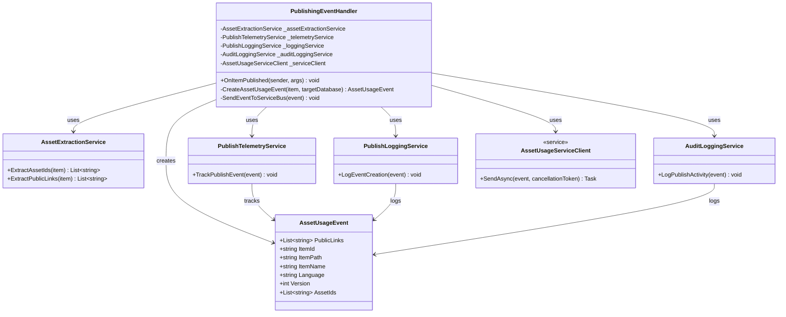

# Asset Usage Service

A microservice for tracking and managing relationships between items and digital assets across Sitecore CMS and ContentHub DAM. Built as an Azure Function application with MongoDB storage.

## Table of Contents

- [Overview](#overview)
- [Architecture](#architecture)
- [Complete Data Flow](#complete-data-flow)
- [Technology Stack](#technology-stack)
- [Prerequisites](#prerequisites)
- [Configuration](#configuration)
- [Data Model](#data-model)
- [API Endpoints](#api-endpoints)
- [Integration Points](#integration-points)
- [Development Setup](#development-setup)
- [Deployment](#deployment)
- [Testing](#testing)

## Overview

The Asset Usage Service provides a centralized system for tracking which digital assets (from ContentHub DAM) are used in Sitecore CMS items. It maintains bidirectional relationships through an event-driven architecture.

### Key Features

- Track which assets are used by specific Sitecore items
- Find which Sitecore items are using specific assets
- Calculate delta changes for asset usage
- Synchronize asset metadata between Sitecore and ContentHub

## Architecture

Microservice diagram: 

```mermaid
classDiagram
    %% Integration Layer
    class MessageHandler {
        -ILogger~MessageHandler~ _logger
        -PublishedItemMapper _mapper
        -AssetItemController _controller
        +MessageHandler(logger, mapper, controller)
        +ProcessMessageAsync(message, cancellationToken) Task
    }

    class PublishedItemMapper {
        -ILogger~PublishedItemMapper~ _logger
        +PublishedItemMapper(logger)
        +MapToDomain(dto) PublishedItem
        -ValidateAndParseItemId(itemIdString) Guid
        -ParseAssetIds(assetIdStrings) List~int~
    }

    class APIGateway {
        +SendRequest() Task
    }

    class ContentHubConnectionService {
        +GetAssetsByPublicLinks() Task
    }

    %% Business Layer
    class AssetItemController {
        -PublishAssetIdsByPublicLinksEventService _publishGetAssetIdsByPublicLinksEventService
        -DeltaCalculationService _deltaCalculationService
        -PublishPushToDamEventsService _publishPushToDamEventsService
        -ILogger~AssetItemController~ _logger
        +AssetItemController(publishService, deltaService, pushService, logger)
        +ProcessPublishedItemAsync(publishedItem, cancellationToken) Task
    }

    class DeltaCalculationService {
        -IAssetItemLinkRepository _assetItemLinkRepository
        -ILogger~DeltaCalculationService~ _logger
        +DeltaCalculationService(repository, logger)
        +CalculateDeltaAsync(item, newAssetIds, cancellationToken) Task~ItemAssetChanges~
        -GetCurrentAssetIdsAsync(itemId, cancellationToken) Task~List~int~~
        -CalculateDelta(currentAssetIds, newAssetIds) Tuple
        -ApplyChangesAsync(itemId, itemExists, newAssetIds, assetIdsToAdd, assetIdsToRemove, cancellationToken) Task
    }

    class PublishAssetIdsByPublicLinksEventService {
        -IMediator _mediator
        -IConfiguration _configuration
        -ILogger~PublishAssetIdsByPublicLinksEventService~ _logger
        +PublishAssetIdsByPublicLinksEventService(mediator, configuration, logger)
        +GetAssetIdsByPublicLinksAsync(publishedItem, cancellationToken) Task~List~int~~
        -FilterContentHubLinks(publicLinks) List~string~
    }

    class PublishPushToDamEventsService {
        -ILogger~PublishPushToDamEventsService~ _logger
        -IMediator _mediator
        +PublishPushToDamEventsService(logger, mediator)
        +PublishPushToDamEventsAsync(itemAssetChanges, cancellationToken) Task
    }

    class PushToDamHandler {
        +Handle(event, cancellationToken) Task
    }

    %% Domain Models
    class PublishedItem {
        +Guid ItemId
        +string Language
        +string ItemName
        +int Version
        +string ItemPath
        +List~int~ AssetIds
        +List~string~ PublicLinks
        -PublishedItem(itemId, language, itemName, version, itemPath, assetIds, publicLinks)
        +Create(itemId, language, itemName, version, itemPath, assetIds, publicLinks)$ PublishedItem
        +GetUsageTrackingJson() JObject
    }

    class PublishedItemDto {
        +string ItemId
        +string Language
        +string ItemName
        +int Version
        +string ItemPath
        +List~string~ AssetIds
        +List~string~ PublicLinks
    }

    class ItemAssetChanges {
        +PublishedItem Item
        +List~int~ ToAddAssetIds
        +List~int~ ToRemoveAssetIds
    }

    class AssetItemLink {
        +Guid ItemId
        +List~int~ AssetIds
        +DateTime CreatedAt
        +DateTime UpdatedAt
    }

    %% Events
    class PushToDamEvent {
        +PublishedItem Item
        +List~int~ AssetIds
        +DamOperation Operation
    }

    %% Infrastructure
    class IAssetItemLinkRepository {
        <<interface>>
        +InsertAssetItemLinkAsync(itemId, assetIds, cancellationToken) Task~AssetItemLink~
        +GetAssetItemLinkByItemIdAsync(itemId, cancellationToken) Task~AssetItemLink~
        +GetAssetIdsFromItemIdAsync(itemId, cancellationToken) Task~List~int~~
        +GetItemIdsByAssetIdAsync(assetId, cancellationToken) Task~List~AssetItemLink~~
        +RemoveAssetIdsFromItemAsync(itemId, assetIds, cancellationToken) Task
        +AddAssetIdsToItemAsync(itemId, assetIds, cancellationToken) Task
        +RemoveItemAsync(itemId, cancellationToken) Task
    }

    class AssetItemLinkRepository {
        +InsertAssetItemLinkAsync(itemId, assetIds, cancellationToken) Task~AssetItemLink~
        +GetAssetItemLinkByItemIdAsync(itemId, cancellationToken) Task~AssetItemLink~
        +GetAssetIdsFromItemIdAsync(itemId, cancellationToken) Task~List~int~~
        +GetItemIdsByAssetIdAsync(assetId, cancellationToken) Task~List~AssetItemLink~~
        +RemoveAssetIdsFromItemAsync(itemId, assetIds, cancellationToken) Task
        +AddAssetIdsToItemAsync(itemId, assetIds, cancellationToken) Task
        +RemoveItemAsync(itemId, cancellationToken) Task
    }

    class IMediator {
        <<interface>>
        +PublishAsync~TEvent~(event, cancellationToken) Task
    }

    %% Relationships
    MessageHandler --> PublishedItemMapper : uses
    MessageHandler --> AssetItemController : uses
    PublishedItemMapper --> PublishedItemDto : maps from
    PublishedItemMapper --> PublishedItem : creates

    AssetItemController --> PublishAssetIdsByPublicLinksEventService : uses
    AssetItemController --> DeltaCalculationService : uses
    AssetItemController --> PublishPushToDamEventsService : uses
    AssetItemController --> PublishedItem : processes

    DeltaCalculationService --> IAssetItemLinkRepository : uses
    DeltaCalculationService --> PublishedItem : uses
    DeltaCalculationService --> ItemAssetChanges : creates

    PublishAssetIdsByPublicLinksEventService --> IMediator : uses
    PublishAssetIdsByPublicLinksEventService --> PublishedItem : uses

    PublishPushToDamEventsService --> IMediator : uses
    PublishPushToDamEventsService --> ItemAssetChanges : uses
    PublishPushToDamEventsService --> PushToDamEvent : publishes

    PushToDamHandler --> PushToDamEvent : handles

    AssetItemLinkRepository ..|> IAssetItemLinkRepository : implements
    AssetItemLinkRepository --> AssetItemLink : manages

    ItemAssetChanges --> PublishedItem : contains                                                                                                         
```


Publishing script diagram: 


### System Components

```
┌──────────────────────────────────────────────────────────────────┐
│                        SITECORE CMS                               │
│                                                                    │
│  ┌──────────────────────────────────────────────────────────┐   │
│  │         iO.Sitecore.Publishing Module                     │   │
│  │         - PublishEventHandler                             │   │
│  │         - OnItemProcessing                                │   │
│  │         - OnItemProcessed                                 │   │
│  │         - OnPublishEnd                                    │   │
│  └────────────────────────┬─────────────────────────────────┘   │
│                           │                                       │
└───────────────────────────┼───────────────────────────────────────┘
                            │
                            │ HTTP POST
                            │ (Publish Events)
                            ▼
┌──────────────────────────────────────────────────────────────────┐
│                   ASSET USAGE SERVICE                             │
│                   (Azure Functions)                               │
│                                                                    │
│  ┌──────────────────────────────────────────────────────────┐   │
│  │             SitecorePublishAPI                            │   │
│  │             (HTTP Trigger)                                │   │
│  └────────────────────────┬─────────────────────────────────┘   │
│                           │                                       │
│  ┌────────────────────────▼─────────────────────────────────┐   │
│  │           Business Layer                                  │   │
│  │           - AssetItemController                           │   │
│  │           - DeltaCalculationService                       │   │
│  │           - PushToDamHandler                              │   │
│  └────────────────────────┬─────────────────────────────────┘   │
│                           │                                       │
│  ┌────────────────────────▼─────────────────────────────────┐   │
│  │           Infrastructure Layer                            │   │
│  │           - AssetItemLinkRepository                       │   │
│  └────────────────────────┬─────────────────────────────────┘   │
│                           │                                       │
│  ┌────────────────────────▼─────────────────────────────────┐   │
│  │           Data Access Layer                               │   │
│  │           - DBContext                                     │   │
│  └────────────────────────┬─────────────────────────────────┘   │
│                           │                                       │
└───────────────────────────┼───────────────────────────────────────┘
                            │
        ┌───────────────────┼────────────────────┐
        │                   │                    │
        ▼                   ▼                    ▼
  ┌──────────┐      ┌──────────────┐    ┌──────────────┐
  │ MongoDB  │      │  ContentHub  │    │ Application  │
  │ Database │      │     DAM      │    │   Insights   │
  └──────────┘      └──────────────┘    └──────────────┘
```

## Complete Data Flow

### 1. Sitecore Publish Event Flow

```
SITECORE CMS
     │
     │ (1) User publishes item
     ▼
┌─────────────────────────────────┐
│  Sitecore Publishing Pipeline   │
└──────────────┬──────────────────┘
               │
               │ (2) Trigger publish:itemProcessing event
               ▼
┌─────────────────────────────────┐
│ iO.Sitecore.Publishing          │
│ PublishEventHandler             │
│ OnItemProcessing()              │
└──────────────┬──────────────────┘
               │
               │ (3) Extract item data:
               │     - Item ID (Guid)
               │     - Asset references
               │     - Public links
               │     - Metadata
               ▼
┌─────────────────────────────────┐
│ AssetUsageServiceClient         │
│ SendAsync()                     │
└──────────────┬──────────────────┘
               │
               │ (4) HTTP POST to Asset Usage Service
               │     Endpoint: /api/SitecorePublishAPI
               │     Body: AssetUsageEvent {
               │       "itemId": "guid",
               │       "assetIds": ["123", "456"],
               │       "publicLinks": ["..."],
               │       "itemName": "...",
               │       "itemPath": "...",
               │       "language": "en",
               │       "version": 1
               │     }
               ▼
┌─────────────────────────────────┐
│ ASSET USAGE SERVICE             │
│ SitecorePublishAPI Function     │
└──────────────┬──────────────────┘
               │
               │ (5) Process publish event
               ▼
     [Continue to Service Processing Flow]
```

### 2. Asset Usage Service Processing Flow

```
Asset Usage Service
     │
     │ (1) Receive publish event from Sitecore
     ▼
┌─────────────────────────────────┐
│ SitecorePublishAPI              │
│ (HTTP Trigger)                  │
└──────────────┬──────────────────┘
               │
               │ (2) Validate request
               │     - Check payload
               ▼
┌─────────────────────────────────┐
│ MessageHandler                  │
│ HandleMessageAsync()            │
└──────────────┬──────────────────┘
               │
               │ (3) Map DTO to Domain
               ▼
┌─────────────────────────────────┐
│ PublishedItemMapper             │
│ MapToDomain()                   │
└──────────────┬──────────────────┘
               │
               │ (4) Process published item
               ▼
┌─────────────────────────────────┐
│ AssetItemController             │
│ ProcessPublishedItemAsync()     │
└──────────────┬──────────────────┘
               │
               │ (5) Get asset IDs from public links
               ▼
┌─────────────────────────────────┐
│ PublishAssetIdsByPublicLinks    │
│ EventService                    │
└──────────────┬──────────────────┘
               │
               │ (6) Calculate delta changes
               ▼
┌─────────────────────────────────┐
│ DeltaCalculationService         │
│ CalculateDeltaAsync()           │
└──────────────┬──────────────────┘
               │
               │ (7) Query existing relationships
               ▼
┌─────────────────────────────────┐
│ AssetItemLinkRepository         │
│ GetAssetItemLinkByItemIdAsync() │
└──────────────┬──────────────────┘
               │
               │ (8) Fetch from MongoDB
               ▼
┌─────────────────────────────────┐
│ MongoDB Database                │
│ AssetItemLinks Collection       │
└──────────────┬──────────────────┘
               │
               │ (9) Return existing data
               ▼
┌─────────────────────────────────┐
│ DeltaCalculationService         │
│ - Calculate added assets        │
│ - Calculate removed assets      │
└──────────────┬──────────────────┘
               │
               │ (10) Update MongoDB
               ▼
┌─────────────────────────────────┐
│ AssetItemLinkRepository         │
│ InsertAssetItemLinkAsync()      │
└──────────────┬──────────────────┘
               │
               │ (11) Publish DAM events
               ▼
┌─────────────────────────────────┐
│ PublishPushToDamEventsService   │
│ PublishPushToDamEventsAsync()   │
└──────────────┬──────────────────┘
               │
               │ (12) Handle DAM updates
               ▼
     [Continue to ContentHub Flow]
```

### 3. ContentHub DAM Integration Flow

```
Asset Usage Service
     │
     │ (1) Prepare asset updates
     ▼
┌─────────────────────────────────┐
│ PushToDamHandler                │
│ Handle(PushToDamEvent)          │
└──────────────┬──────────────────┘
               │
               │ (2) Get ContentHub client
               ▼
┌─────────────────────────────────┐
│ APIGateway                      │
│ GetContentHubClientAsync()      │
└──────────────┬──────────────────┘
               │
               │ (3) Authenticate
               ▼
┌─────────────────────────────────┐
│ ContentHubConnectionService     │
│ CreateClient()                  │
└──────────────┬──────────────────┘
               │
               │ (4) OAuth2 Client Credentials
               │     - ClientId
               │     - ClientSecret
               ▼
┌─────────────────────────────────┐
│ Stylelabs M.Sdk WebClient       │
└──────────────┬──────────────────┘
               │
               │ (5) HTTPS Connection
               ▼
┌─────────────────────────────────┐
│ Sitecore ContentHub             │
│ REST API                        │
└──────────────┬──────────────────┘
               │
               │ (6) Update asset relations:
               │     - Link to Sitecore items
               │     - Update usage metadata
               │     - Set relation properties
               ▼
┌─────────────────────────────────┐
│ ContentHub Database             │
│ Asset Relations Updated         │
└─────────────────────────────────┘
```

### 4. Reverse Query Flow (Asset → Items)

```
External System / ContentHub
     │
     │ (1) Query: "Which items use Asset X?"
     ▼
┌─────────────────────────────────┐
│ Asset Usage Service API         │
│ (Future endpoint)               │
└──────────────┬──────────────────┘
               │
               │ (2) GetItemIdsByAssetId(X)
               ▼
┌─────────────────────────────────┐
│ AssetItemLinkRepository         │
└──────────────┬──────────────────┘
               │
               │ (3) MongoDB Query:
               │     db.AssetItemLinks.find({
               │       assetIds: X
               │     })
               ▼
┌─────────────────────────────────┐
│ MongoDB Database                │
│ Index Scan on assetIds          │
└──────────────┬──────────────────┘
               │
               │ (4) Return matching documents
               ▼
┌─────────────────────────────────┐
│ Response to Caller              │
│ [                               │
│   { itemId: "guid1", ... },     │
│   { itemId: "guid2", ... }      │
│ ]                               │
└─────────────────────────────────┘
```

### 5. Complete End-to-End Flow

```
┌─────────────────┐
│ SITECORE CMS    │
│                 │
│ Content Editor  │
│ publishes item  │
│ with assets     │
└────────┬────────┘
         │
         │ Publish Pipeline
         ▼
┌─────────────────────────────────┐
│ iO.Sitecore.Publishing          │
│ Event Handler                   │
│                                 │
│ 1. OnItemProcessing             │
│    - Extract item data          │
│    - Extract asset IDs          │
│    - Extract public links       │
│                                 │
│ 2. OnItemProcessed              │
│    - Create AssetUsageEvent     │
│    - POST to Asset Service      │
│                                 │
│ 3. OnPublishEnd                 │
│    - Batch processing complete  │
└────────┬────────────────────────┘
         │
         │ HTTP POST
         │ http://localhost:7183/api/SitecorePublishAPI
         ▼
┌─────────────────────────────────┐
│ ASSET USAGE SERVICE             │
│ (Azure Function)                │
│                                 │
│ 1. Receive Event                │
│    - Validate payload           │
│    - Map to domain model        │
│                                 │
│ 2. Resolve Asset IDs            │
│    - Convert public links       │
│                                 │
│ 3. Query MongoDB                │
│    - Get current state          │
│                                 │
│ 4. Calculate Delta              │
│    - Compare old vs new         │
│    - Identify changes           │
│                                 │
│ 5. Update MongoDB               │
│    - Save new relationships     │
│    - Update timestamps          │
│                                 │
│ 6. Sync to ContentHub           │
│    - Publish DAM events         │
│    - Update asset metadata      │
└────────┬────────────────────────┘
         │
         │ OAuth2 + REST API
         ▼
┌─────────────────────────────────┐
│ SITECORE CONTENTHUB             │
│                                 │
│ 1. Authenticate Request         │
│                                 │
│ 2. Update Asset Relations       │
│    - Link to Sitecore items     │
│                                 │
│ 3. Update Metadata              │
│    - Usage count                │
│    - Last used date             │
│    - Related items list         │
└─────────────────────────────────┘
```

## Technology Stack

### Core Technologies

- **.NET 8.0**: Application framework
- **Azure Functions (Isolated Worker)**: Serverless compute
- **MongoDB**: NoSQL document database
- **Sitecore CMS**: Content management system
- **Sitecore ContentHub SDK**: DAM integration
- **Application Insights**: Monitoring and telemetry

### Key Dependencies

- `Microsoft.Azure.Functions.Worker`
- `MongoDB.Driver`
- `Stylelabs.M.Sdk.WebClient`
- `Microsoft.Extensions.DependencyInjection`

## Prerequisites

- .NET 8.0 SDK or later
- Azure Functions Core Tools v4
- MongoDB instance (local or Azure CosmosDB with MongoDB API)
- Sitecore CMS instance (with iO.Sitecore.Publishing module)
- Access to Sitecore ContentHub instance

## Configuration

### Sitecore CMS Configuration

#### 1. Event Handler Configuration

Install the `iO.Sitecore.Publishing` event handler by placing the configuration file in:

`C:\inetpub\wwwroot\[SITECORE.INSTANCE]\App_Config\Include\zzz.iO\iO.Publishing.Events.config`

```xml
<configuration xmlns:patch="http://www.sitecore.net/xmlconfig/">
  <sitecore>
    <events>
      <event name="publish:itemProcessing">
        <handler type="iO.Sitecore.publishing.Events.PublishEventHandler, iO.Sitecore.publishing" method="OnItemProcessing" />
      </event>
      <event name="publish:itemProcessed">
        <handler type="iO.Sitecore.publishing.Events.PublishEventHandler, iO.Sitecore.publishing" method="OnItemProcessed" />
      </event>
      <event name="publish:end">
        <handler type="iO.Sitecore.publishing.Events.PublishEventHandler, iO.Sitecore.publishing" method="OnPublishEnd" />
      </event>
      <event name="publish:end:remote">
        <handler type="iO.Sitecore.publishing.Events.PublishEventHandler, iO.Sitecore.publishing" method="OnPublishEndRemote" />
      </event>
    </events>
  </sitecore>
</configuration>
```

#### 2. Asset Usage Service Configuration

Create a configuration file in:

`C:\inetpub\wwwroot\[SITECORE.INSTANCE]\App_Config\Include\AssetUsageService.config`

```xml
<?xml version="1.0" encoding="utf-8"?>
<configuration xmlns:patch="http://www.sitecore.net/xmlconfig/">
  <sitecore>
    <settings>
      <!-- Azure Function endpoint for Asset Usage Service -->
      <setting name="AssetUsageService.ApiEndpoint" value="http://localhost:7183/api/SitecorePublishAPI" />
    </settings>
  </sitecore>
</configuration>
```

### Asset Usage Service Configuration

Configure in `local.settings.json` (local) or Azure Function App Configuration (production):

```json
{
  "IsEncrypted": false,
  "Values": {
    "AzureWebJobsStorage": "UseDevelopmentStorage=true",
    "FUNCTIONS_WORKER_RUNTIME": "dotnet-isolated",
    
    "MongoDB:ConnectionString": "mongodb://localhost:27017",
    "MongoDB:DatabaseName": "AssetUsageDb",
    "MongoDB:SeedData": "false",
    
    "ContentHub:Endpoint": "https://your-instance.stylelabs.cloud",
    "ContentHub:ClientId": "your-client-id",
    "ContentHub:ClientSecret": "your-client-secret",
    
    "APPLICATIONINSIGHTS_CONNECTION_STRING": "your-app-insights-connection-string"
  }
}
```

### Configuration Options

#### Sitecore Settings

- **AssetUsageService.ApiEndpoint**: Asset Usage Service API endpoint (HTTP/HTTPS URL)

#### MongoDB Settings

- **ConnectionString**: MongoDB connection string
- **DatabaseName**: Database name for asset usage data
- **SeedData**: Set to `true` to populate test data on startup

#### ContentHub Settings

- **Endpoint**: ContentHub instance URL
- **ClientId**: OAuth2 client ID
- **ClientSecret**: OAuth2 client secret

## Data Model

### AssetItemLink Collection

Document structure in MongoDB:

```json
{
  "_id": "3fa85f64-5717-4562-b3fc-2c963f66afa6",  // Guid (ItemId)
  "assetIds": [34013, 13343, 23213],               // List<int>
  "createdAt": "2025-11-06T10:30:00Z",            // DateTime
  "updatedAt": "2025-11-06T14:25:00Z"             // DateTime
}
```

#### Field Descriptions

- **_id (ItemId)**: Unique identifier for the Sitecore item (GUID)
- **assetIds**: Array of asset IDs from ContentHub DAM
- **createdAt**: Timestamp when the relationship was first created (UTC)
- **updatedAt**: Timestamp of the last update to asset relationships (UTC)

#### Indexes

```javascript
db.AssetItemLinks.createIndex({ "assetIds": 1 })
db.AssetItemLinks.createIndex({ "updatedAt": -1, "createdAt": -1 })
```

## API Endpoints

### SitecorePublishAPI

**Endpoint**: `POST /api/SitecorePublishAPI`

**Authorization**: Function level

**Description**: Receives publish events from Sitecore CMS

**Request Body**:
```json
{
  "itemId": "3fa85f64-5717-4562-b3fc-2c963f66afa6",
  "itemName": "Home Page",
  "itemPath": "/sitecore/content/Home",
  "language": "en",
  "version": 1,
  "assetIds": ["34013", "13343", "23213"],
  "publicLinks": ["https://contenthub.example.com/api/public/content/...", "..."]
}
```

**Response**:
- `202 Accepted`: Event successfully queued for processing
- `400 Bad Request`: Invalid payload or processing error

**Response Body** (on error):
```json
{
  "error": "Error message describing the issue"
}
```

## Integration Points

### Sitecore CMS Integration

The `iO.Sitecore.Publishing` module captures publish events:

- **OnItemProcessing**: Triggered when item enters publish pipeline
- **OnItemProcessed**: Triggered after item is published - sends HTTP POST to Asset Usage Service
- **OnPublishEnd**: Triggered when publish operation completes
- **OnPublishEndRemote**: Triggered for remote publish events

### AssetUsageServiceClient

The client handles HTTP communication with the Asset Usage Service:

```csharp
public class AssetUsageServiceClient : IDisposable
{
    public async Task SendAsync(AssetUsageEvent payload, CancellationToken cancellationToken = default)
    {
        // Validates payload
        // Serializes to JSON
        // POSTs to configured endpoint
        // Handles errors and logging
    }
}
```

### Repository Interface

```csharp
public interface IAssetItemLinkRepository
{
    Task<AssetItemLink> InsertAssetItemLinkAsync(
        Guid itemId, 
        List<int> assetIds, 
        CancellationToken cancellationToken = default);
    
    Task<AssetItemLink?> GetAssetItemLinkByItemIdAsync(
        Guid itemId, 
        CancellationToken cancellationToken = default);
    
    Task<List<int>> GetAssetIdsFromItemIdAsync(
        Guid itemId, 
        CancellationToken cancellationToken = default);
    
    Task<List<AssetItemLink>> GetItemIdsByAssetIdAsync(
        int assetId, 
        CancellationToken cancellationToken = default);
        
    Task RemoveAssetIdsFromItemAsync(
        Guid itemId, 
        List<int> assetIds, 
        CancellationToken cancellationToken = default);
        
    Task AddAssetIdsToItemAsync(
        Guid itemId, 
        List<int> assetIds, 
        CancellationToken cancellationToken = default);
        
    Task RemoveItemAsync(
        Guid itemId, 
        CancellationToken cancellationToken = default);
}
```

### ContentHub Integration

The `ContentHubConnectionService` manages authentication and connectivity:

```csharp
var client = await apiGateway.GetContentHubClientAsync();
var isReachable = await apiGateway.IsContentHubReachableAsync();
```

## Development Setup

### Local Development

1. Clone the repository:
```bash
git clone https://github.com/weareyou/asset-usage-service.git
cd asset-usage-service
```

2. Install dependencies:
```bash
dotnet restore
```

3. Configure local settings:
```bash
cp local.settings.json.example local.settings.json
# Edit local.settings.json with your configuration
```

4. Start MongoDB:
```bash
docker run -d -p 27017:27017 --name mongodb mongo:latest
```

5. Run the application:
```bash
func start
```

6. Configure Sitecore:
- Copy `iO.Sitecore.publishing.dll` to your Sitecore instance bin folder
- Create `iO.Publishing.Events.config` in `App_Config\Include\zzz.iO\`
- Create `AssetUsageService.config` in `App_Config\Include\`
- Update `AssetUsageService.ApiEndpoint` to point to your local function
- Restart Sitecore

### Project Structure

```
asset-usage-service/
├── AssetUsageService/
│   ├── Business/
│   │   ├── Controllers/
│   │   │   └── AssetItemController.cs
│   │   ├── Events/
│   │   │   ├── PushToDamEvent.cs
│   │   │   └── AssetIdsByPublicLinksEvent.cs
│   │   ├── Handlers/
│   │   │   ├── PushToDamHandler.cs
│   │   │   └── AssetIdsByPublicLinksHandler.cs
│   │   └── Services/
│   │       ├── DeltaCalculationService.cs
│   │       ├── PublishAssetIdsByPublicLinksEventService.cs
│   │       └── PublishPushToDamEventsService.cs
│   ├── Domain/
│   │   ├── Data/
│   │   │   ├── AssetItemLink.cs
│   │   │   └── DBContext.cs
│   │   └── Models/
│   │       ├── PublishedItem.cs
│   │       ├── PublishedItemDto.cs
│   │       └── ItemAssetChanges.cs
│   ├── Infrastructure/
│   │   ├── AssetItemLinkRepository.cs
│   │   └── IAssetItemLinkRepository.cs
│   ├── Integration/
│   │   ├── APIGateway.cs
│   │   ├── ContentHubConnectionService.cs
│   │   ├── MessageHandler.cs
│   │   └── PublishedItemMapper.cs
│   └── Program.cs
├── AssetUsageServiceTests/
│   ├── Integration/
│   │   └── ContentHubConnectionServiceTests.cs
│   └── Performance/
├── iO.Sitecore.publishing/
│   └── Events/
│       ├── PublishEventHandler.cs
│       └── AssetUsageServiceClient.cs
├── iO.Publishing.Events
├── iO.Publishing.Events.example
└── README.md
```
## Deployment

This guide covers deploying the .NET 8 isolated Azure Function that integrates with Sitecore Content Hub and Cosmos DB for MongoDB (vCore).

### Overview

All environment-specific values are provided via Azure Key Vault and GitHub Secrets; nothing is hard-coded in source.

> **Note**: Double-underscore (`__`) in app settings maps to `:` for .NET configuration.

### Required App Settings

- `ContentHub__Endpoint`
- `ContentHub__ClientId`
- `ContentHub__ClientSecret`
- `MongoDb__ConnectionString` (note the capital S)
- `MongoDB__DatabaseName`

### Prerequisites

Before deploying, you'll need the following values:

- `<AZ_SUBSCRIPTION_ID>` - Your Azure subscription ID
- `<AZ_TENANT_ID>` - Your Azure tenant ID
- `<AZ_CLIENT_ID>` - GitHub OIDC service principal client ID
- `<RESOURCE_GROUP>` - Azure resource group name
- `<FUNCTION_APP_NAME>` - Function app name (e.g., `asset-usage-fa`)
- `<KEYVAULT_NAME>` - Key vault name (e.g., `asset-usage-kv`)
- `<MONGO_CONNECTION_STRING>` - SRV format; tls=true; SCRAM-SHA-256; optionally authSource=admin
- `<MONGO_DATABASE_NAME>` - Logical database name (e.g., `asset-usage`)
- `<CONTENTHUB_ENDPOINT>` - ContentHub endpoint (e.g., `https://your-env.sitecoresandbox.cloud`)
- `<CONTENTHUB_CLIENT_ID>` - ContentHub client ID
- `<CONTENTHUB_CLIENT_SECRET>` - ContentHub client secret

### Step 1: Prepare Azure Resources and Identity

1. Ensure the Function App (`<FUNCTION_APP_NAME>`) exists and uses .NET 8 isolated (Linux)
2. Enable system-assigned Managed Identity on the Function App
3. Grant Key Vault access:
   - **If using Azure RBAC**: Assign "Key Vault Secrets User" to the Function App's identity at vault scope
   - **If using Access Policies**: Grant get/list on secrets

### Step 2: Create Key Vault Secrets

Create the following versionless secrets (one per environment):

- `MongoDbConnectionString` = `<MONGO_CONNECTION_STRING>`
- `ContentHub-ClientId` = `<CONTENTHUB_CLIENT_ID>`
- `ContentHub-ClientSecret` = `<CONTENTHUB_CLIENT_SECRET>`

### Step 3: Configure Function App Settings

Set the following application settings (no secrets in plain text):

```
ContentHub__Endpoint = <CONTENTHUB_ENDPOINT>
ContentHub__ClientId = @Microsoft.KeyVault(SecretUri=https://<KEYVAULT_NAME>.vault.azure.net/secrets/ContentHub-ClientId)
ContentHub__ClientSecret = @Microsoft.KeyVault(SecretUri=https://<KEYVAULT_NAME>.vault.azure.net/secrets/ContentHub-ClientSecret)
MongoDb__ConnectionString = @Microsoft.KeyVault(SecretUri=https://<KEYVAULT_NAME>.vault.azure.net/secrets/MongoDbConnectionString)
MongoDB__DatabaseName = <MONGO_DATABASE_NAME>
```

Restart the Function App and verify in Kudu `/Env` that `WEBSITE_KEYVAULT_REFERENCES` shows "Resolved".

### Step 4: Set Up CI/CD with GitHub Actions

#### Option A: Azure-Generated Workflow (Recommended)

1. In Azure Portal, go to: Function App > Deployment Center
2. Set Source: GitHub
3. Choose your repository and branch `main`
4. Set Runtime: .NET 8 (isolated)
5. Set Build provider: GitHub Actions
6. Click Save

Azure will automatically commit a workflow file and create the needed GitHub secrets for OIDC.

#### Option B: Manual Workflow Setup

1. Create the following repository secrets:
   - `AZURE_SUBSCRIPTION_ID` = `<AZ_SUBSCRIPTION_ID>`
   - `AZURE_TENANT_ID` = `<AZ_TENANT_ID>`
   - `AZURE_CLIENT_ID` = `<AZ_CLIENT_ID>`

2. Add this file at `.github/workflows/function-deploy.yml`:

```yaml
name: Build and deploy dotnet core project to Azure Function App

on:
  push:
    branches: [ main ]
  workflow_dispatch:

env:
  DOTNET_VERSION: '8.0.x'
  AZURE_FUNCTIONAPP_PACKAGE_PATH: './AssetUsageService'    # change if your project path differs
  FUNCTION_APP_NAME: '<FUNCTION_APP_NAME>'                 # or set via repo/environment variables

jobs:
  build-and-deploy:
    runs-on: ubuntu-latest
    permissions:
      id-token: write
      contents: read

    steps:
    - name: Checkout
      uses: actions/checkout@v4

    - name: Setup .NET
      uses: actions/setup-dotnet@v1
      with:
        dotnet-version: ${{ env.DOTNET_VERSION }}

    - name: Add Sitecore NuGet feed
      run: dotnet nuget add source https://nuget.sitecore.com/resources/v3/index.json --name SitecoreOfficial

    - name: Build
      run: |
        pushd '${{ env.AZURE_FUNCTIONAPP_PACKAGE_PATH }}'
        dotnet restore
        dotnet build --configuration Release --output ./output
        popd

    - name: Azure login (OIDC)
      uses: azure/login@v2
      with:
        client-id: ${{ secrets.AZURE_CLIENT_ID }}
        tenant-id: ${{ secrets.AZURE_TENANT_ID }}
        subscription-id: ${{ secrets.AZURE_SUBSCRIPTION_ID }}

    - name: Deploy to Azure Functions
      uses: Azure/functions-action@v1
      with:
        app-name: ${{ env.FUNCTION_APP_NAME }}
        slot-name: 'Production'
        package: '${{ env.AZURE_FUNCTIONAPP_PACKAGE_PATH }}/output'
```

> **Notes**:
> - If you deploy multiple environments, use GitHub "environments" (dev/stage/prod) with environment-level secrets and set `FUNCTION_APP_NAME` per environment
> - For private NuGet sources, add an authenticated `dotnet nuget add source` with `--username` and `--password ${{ secrets.<FEED_TOKEN> }} --store-password-in-clear-text`
> - The Sitecore NuGet feed step is **required** for building this project

### Step 5: Configure Sitecore to Use Your Function

#### Recommended Approach (No Secrets in URL)

Sitecore keeps a clean endpoint; the HTTP client sends the function key in header `x-functions-key`.

**Configuration**:
```
AssetUsageService.ApiEndpoint = https://<FUNCTION_APP_NAME>.azurewebsites.net/api/SitecorePublishAPI
AssetUsageService.FunctionKey = <FUNCTION_KEY>
```
Store the function key outside source control (e.g., Sitecore Secret Manager/Key Vault or appSetting).

When calling, set header: `x-functions-key: <FUNCTION_KEY>`

#### Legacy Approach (Query String)

If you must embed the code in the query string:

1. Get the function-level key (not the _master host key):
```bash
az functionapp function keys list \
  -g <RESOURCE_GROUP> \
  -n <FUNCTION_APP_NAME> \
  --function-name SitecorePublishAPI \
  --query "default" -o tsv
```

2. Update your Sitecore configuration:
```xml
<?xml version="1.0" encoding="utf-8"?>
<configuration xmlns:patch="http://www.sitecore.net/xmlconfig/">
  <sitecore>
    <settings>
      <setting name="AssetUsageService.ApiEndpoint" 
               value="https://<FUNCTION_APP_NAME>.azurewebsites.net/api/SitecorePublishAPI?code=<FUNCTION_KEY>" />
    </settings>
  </sitecore>
</configuration>
```

### Step 6: Smoke Test

1. In Azure Portal, navigate to: Functions > SitecorePublishAPI > Test/Run
2. Set Header: `Content-Type=application/json`
3. Use this test body:
```json
{
  "ItemId": "110d559f-dea5-42ea-9c1c-8a5df7e70ef9",
  "Language": "en",
  "ItemName": "Home",
  "Version": 1,
  "ItemPath": "/sitecore/content/Home",
  "AssetIds": [],
  "PublicLinks": []
}
```

4. Expect `200`/`204` response
5. Verify in Application Insights:
   - Dependencies show `200`/`204` for Content Hub calls
   - MongoDB writes are visible in `<MONGO_DATABASE_NAME>`

### Troubleshooting

#### Key Vault Resolution Issues

After changing any secret version, restart the Function App or Save an app setting to force immediate re-resolution.

#### SASL Authentication Errors

- Ensure your Key Vault value matches a mongosh-tested SRV URI
- Include `tls=true` in connection string
- Add `authSource=admin` if your user is in the admin database
- Confirm hostname is the vCore SRV (`*.mongocluster.cosmos.azure.com`)

#### Missing "ContentHub:Endpoint" Error

- Verify `ContentHub__Endpoint` is set (note double underscore)
- Ensure `ClientId`/`ClientSecret` are present as Key Vault references and valid

#### Verify Settings in Kudu

Navigate to `/Env` in Kudu:
- Key Vault-backed settings should show "[Hidden - Resolved]"
- `WEBSITE_KEYVAULT_REFERENCES` section should show status "Resolved"

### Visual Studio Publish (Optional, One-Time)

For initial deployment or quick updates:

1. Right-click your Function project
2. Select Publish > Azure > Function App (Linux)
3. Select `<FUNCTION_APP_NAME>`
4. Click Publish

> **Note**: Use CI/CD workflow for ongoing deployments.

## Testing

### Running Tests

```bash
# Run all tests
dotnet test

# Run performance tests only
dotnet test --filter "Category=Performance"

# Run integration tests only
dotnet test --filter "FullyQualifiedName~Integration"
```

### Test Categories

- **Unit Tests**: Business logic and service tests
- **Integration Tests**: ContentHub and MongoDB integration
- **Performance Tests**: Repository performance benchmarks

### Example Test Data

The service includes seed data for testing (when `MongoDB:SeedData` is `true`):

```csharp
new AssetItemLink
{
    ItemId = Guid.NewGuid(),
    AssetIds = new List<int>{34013, 13343},
    CreatedAt = DateTime.UtcNow,
    UpdatedAt = DateTime.UtcNow
}
```

## Monitoring and Logging

### Application Insights

The service integrates with Azure Application Insights:

- Request tracing and performance monitoring
- Exception tracking and diagnostics
- Custom metrics and events
- Dependency tracking (MongoDB, ContentHub, Sitecore)

### Logging Levels

Configure in `host.json`:

```json
{
  "logging": {
    "logLevel": {
      "default": "Information",
      "AssetUsageService": "Information",
      "AssetUsageService.Integration": "Debug"
    }
  }
}
```

### Sitecore Logging

The `AssetUsageServiceClient` logs all activities to Sitecore logs:

- Event creation and validation
- HTTP request/response details
- Error conditions and warnings

## Troubleshooting

### Sitecore Integration Issues

- Verify `iO.Sitecore.Publishing.dll` is in the bin folder
- Check Sitecore logs for event handler errors
- Confirm `AssetUsageService.ApiEndpoint` is accessible from Sitecore server
- Validate endpoint URL format (must include http:// or https://)
- Test endpoint connectivity using curl or Postman

### MongoDB Connection Failures

- Verify connection string format
- Check network connectivity and firewall rules
- Ensure MongoDB version compatibility (4.0+)
- Validate database and collection names

### ContentHub Authentication Errors

- Validate ClientId and ClientSecret
- Check OAuth2 permissions in ContentHub
- Verify endpoint URL format (must include https://)
- Test connectivity using `IsContentHubReachableAsync()`

### Common Error Messages

**"AssetUsageService.ApiEndpoint setting is required but not configured"**
- Solution: Add the `AssetUsageService.ApiEndpoint` setting to `AssetUsageService.config`

**"Payload ItemId is null or empty; skipping send"**
- Solution: Verify the item being published has a valid GUID

**"HTTP request failed for ItemId"**
- Solution: Check Azure Function logs for detailed error information
- Verify the function is running and accessible
- Check Application Insights for request traces
