# Asset Usage Service Overview

A microservice for tracking and managing relationships between items and digital assets across Sitecore CMS and ContentHub DAM. Built as an Azure Function application with MongoDB storage.

```mermaid
classDiagram
    %% Integration Layer
    class MessageHandler {
        -ILogger~MessageHandler~ _logger
        -PublishedItemMapper _mapper
        -AssetItemController _controller
        +MessageHandler(logger, mapper, controller)
        +ProcessMessageAsync(message, cancellationToken) Task
    }

    class PublishedItemMapper {
        -ILogger~PublishedItemMapper~ _logger
        +PublishedItemMapper(logger)
        +MapToDomain(dto) PublishedItem
        -ValidateAndParseItemId(itemIdString) Guid
        -ParseAssetIds(assetIdStrings) List~int~
    }

    class APIGateway {
        +SendRequest() Task
    }

    class ContentHubConnectionService {
        +GetAssetsByPublicLinks() Task
    }

    %% Business Layer
    class AssetItemController {
        -PublishAssetIdsByPublicLinksEventService _publishGetAssetIdsByPublicLinksEventService
        -DeltaCalculationService _deltaCalculationService
        -PublishPushToDamEventsService _publishPushToDamEventsService
        -ILogger~AssetItemController~ _logger
        +AssetItemController(publishService, deltaService, pushService, logger)
        +ProcessPublishedItemAsync(publishedItem, cancellationToken) Task
    }

    class DeltaCalculationService {
        -IAssetItemLinkRepository _assetItemLinkRepository
        -ILogger~DeltaCalculationService~ _logger
        +DeltaCalculationService(repository, logger)
        +CalculateDeltaAsync(item, newAssetIds, cancellationToken) Task~ItemAssetChanges~
        -GetCurrentAssetIdsAsync(itemId, cancellationToken) Task~List~int~~
        -CalculateDelta(currentAssetIds, newAssetIds) Tuple
        -ApplyChangesAsync(itemId, itemExists, newAssetIds, assetIdsToAdd, assetIdsToRemove, cancellationToken) Task
    }

    class PublishAssetIdsByPublicLinksEventService {
        -IMediator _mediator
        -IConfiguration _configuration
        -ILogger~PublishAssetIdsByPublicLinksEventService~ _logger
        +PublishAssetIdsByPublicLinksEventService(mediator, configuration, logger)
        +GetAssetIdsByPublicLinksAsync(publishedItem, cancellationToken) Task~List~int~~
        -FilterContentHubLinks(publicLinks) List~string~
    }

    class PublishPushToDamEventsService {
        -ILogger~PublishPushToDamEventsService~ _logger
        -IMediator _mediator
        +PublishPushToDamEventsService(logger, mediator)
        +PublishPushToDamEventsAsync(itemAssetChanges, cancellationToken) Task
    }

    class PushToDamHandler {
        +Handle(event, cancellationToken) Task
    }

    %% Domain Models
    class PublishedItem {
        +Guid ItemId
        +string Language
        +string ItemName
        +int Version
        +string ItemPath
        +List~int~ AssetIds
        +List~string~ PublicLinks
        -PublishedItem(itemId, language, itemName, version, itemPath, assetIds, publicLinks)
        +Create(itemId, language, itemName, version, itemPath, assetIds, publicLinks)$ PublishedItem
        +GetUsageTrackingJson() JObject
    }

    class PublishedItemDto {
        +string ItemId
        +string Language
        +string ItemName
        +int Version
        +string ItemPath
        +List~string~ AssetIds
        +List~string~ PublicLinks
    }

    class ItemAssetChanges {
        +PublishedItem Item
        +List~int~ ToAddAssetIds
        +List~int~ ToRemoveAssetIds
    }

    class AssetItemLink {
        +Guid ItemId
        +List~int~ AssetIds
        +DateTime CreatedAt
        +DateTime UpdatedAt
    }

    %% Events
    class PushToDamEvent {
        +PublishedItem Item
        +List~int~ AssetIds
        +DamOperation Operation
    }

    %% Infrastructure
    class IAssetItemLinkRepository {
        <<interface>>
        +InsertAssetItemLinkAsync(itemId, assetIds, cancellationToken) Task~AssetItemLink~
        +GetAssetItemLinkByItemIdAsync(itemId, cancellationToken) Task~AssetItemLink~
        +GetAssetIdsFromItemIdAsync(itemId, cancellationToken) Task~List~int~~
        +GetItemIdsByAssetIdAsync(assetId, cancellationToken) Task~List~AssetItemLink~~
        +RemoveAssetIdsFromItemAsync(itemId, assetIds, cancellationToken) Task
        +AddAssetIdsToItemAsync(itemId, assetIds, cancellationToken) Task
        +RemoveItemAsync(itemId, cancellationToken) Task
    }

    class AssetItemLinkRepository {
        +InsertAssetItemLinkAsync(itemId, assetIds, cancellationToken) Task~AssetItemLink~
        +GetAssetItemLinkByItemIdAsync(itemId, cancellationToken) Task~AssetItemLink~
        +GetAssetIdsFromItemIdAsync(itemId, cancellationToken) Task~List~int~~
        +GetItemIdsByAssetIdAsync(assetId, cancellationToken) Task~List~AssetItemLink~~
        +RemoveAssetIdsFromItemAsync(itemId, assetIds, cancellationToken) Task
        +AddAssetIdsToItemAsync(itemId, assetIds, cancellationToken) Task
        +RemoveItemAsync(itemId, cancellationToken) Task
    }

    class IMediator {
        <<interface>>
        +PublishAsync~TEvent~(event, cancellationToken) Task
    }

    %% Relationships
    MessageHandler --> PublishedItemMapper : uses
    MessageHandler --> AssetItemController : uses
    PublishedItemMapper --> PublishedItemDto : maps from
    PublishedItemMapper --> PublishedItem : creates

    AssetItemController --> PublishAssetIdsByPublicLinksEventService : uses
    AssetItemController --> DeltaCalculationService : uses
    AssetItemController --> PublishPushToDamEventsService : uses
    AssetItemController --> PublishedItem : processes

    DeltaCalculationService --> IAssetItemLinkRepository : uses
    DeltaCalculationService --> PublishedItem : uses
    DeltaCalculationService --> ItemAssetChanges : creates

    PublishAssetIdsByPublicLinksEventService --> IMediator : uses
    PublishAssetIdsByPublicLinksEventService --> PublishedItem : uses

    PublishPushToDamEventsService --> IMediator : uses
    PublishPushToDamEventsService --> ItemAssetChanges : uses
    PublishPushToDamEventsService --> PushToDamEvent : publishes

    PushToDamHandler --> PushToDamEvent : handles

    AssetItemLinkRepository ..|> IAssetItemLinkRepository : implements
    AssetItemLinkRepository --> AssetItemLink : manages

    ItemAssetChanges --> PublishedItem : contains                                                                                                         
```



## System Components

### Core Components

| Component | Technology | Purpose |
|-----------|------------|---------|
| **Asset Usage Service** | Azure Functions (.NET 8 isolated) | Microservice that tracks asset-item relationships |
| **Database** | MongoDB / Azure CosmosDB (MongoDB API) | Storage for asset usage data |
| **Message Queue** | Azure Service Bus | Asynchronous processing of asset operations |
| **Sitecore CMS** | Sitecore XP | Content management system with iO.Sitecore.Publishing module |
| **ContentHub DAM** | Sitecore ContentHub | Digital asset management system |

### Prerequisites

- .NET 8.0 SDK or later
- Azure Functions Core Tools v4
- MongoDB instance (local or Azure CosmosDB with MongoDB API)
- Sitecore CMS instance (with iO.Sitecore.Publishing module)
- Access to Sitecore ContentHub instance

## Architecture Diagram

```
┌─────────────────┐     ┌─────────────────────────┐     ┌─────────────────┐
│   Sitecore CMS  │────▶│  Asset Usage Service    │────▶│  Content Hub    │
│                 │     │  (Azure Functions)      │     │                 │
│  - Publishing   │     │                         │     │  - Assets       │
│  - Event Handler│     │  - SitecorePublishAPI   │     │  - Public Links │
└─────────────────┘     │  - Queue Functions      │     │  - UsageTracking│
                        │                         │     └─────────────────┘
                        └───────────┬─────────────┘
                                    │
                        ┌───────────▼─────────────┐
                        │       MongoDB           │
                        │  (CosmosDB vCore)       │
                        │                         │
                        │  - AssetItemLinks       │
                        └─────────────────────────┘
```

## Key Features

1. **Asset Tracking**: Tracks relationships between Sitecore items and ContentHub assets
2. **Event-Driven**: Responds to Sitecore publish events automatically
3. **Queue-Based Processing**: Uses Azure Service Bus for reliable async operations
4. **Usage Insights**: Provides visibility into which CMS items use which assets
5. **Delete Protection**: Custom modals warn users before deleting assets in use

## Configuration Overview

### Sitecore CMS Configuration

- **Event Handler**: `iO.Publishing.Events.config` - Captures publish events
- **Service Endpoint**: `AssetUsageService.config` - Points to the Azure Function

### Azure Function Configuration

- **MongoDB Settings**: Connection string and database name
- **ContentHub Settings**: OAuth2 credentials for API access
- **Service Bus Settings**: Queue names and connection strings

### ContentHub Configuration

- **OAuth Client**: Client credentials flow for API authentication
- **Schema Extension**: `UsageTracking` JSON property on M.Asset
- **Member Security**: Read access for all, write access for service user

## Queue Functions

The service uses Azure Service Bus queues for asynchronous processing:

| Queue | Purpose |
|-------|---------|
| `contenthub-publiclinks-requests` | Process public link creation/updates |
| `contenthub-delta-calculation-requests` | Calculate asset usage changes |
| `push-to-contenthub-requests` | Push usage data to ContentHub |

## ContentHub Components

React components for the ContentHub Asset Details page:

1. **Asset Usage Tracker**: Displays which Sitecore CMS items use the asset
2. **Custom Delete Modal**: Warns users if asset is in use before deletion
3. **Custom Archive Modal**: Warns users if asset is in use before archiving

## Deployment Options

- **Azure Portal**: Configure via Deployment Center for automatic CI/CD
- **GitHub Actions**: Manual workflow setup with OIDC authentication
- **Visual Studio**: Direct publish for initial setup or hotfixes

## Required Azure Resources

| Resource | Type | Purpose |
|----------|------|---------|
| **Function App** | Azure Functions (Linux, .NET 8 isolated) | Hosts the microservice |
| **Key Vault** | Azure Key Vault | Secure storage for secrets |
| **Cosmos DB** | Azure Cosmos DB for MongoDB (vCore) | Database storage |
| **Application Insights** | Application Insights | Monitoring and telemetry |

## Monitoring

The service integrates with Azure Application Insights for:

- Request tracing and performance monitoring
- Exception tracking and diagnostics
- Custom metrics and events
- Dependency tracking (MongoDB, ContentHub, Sitecore)
