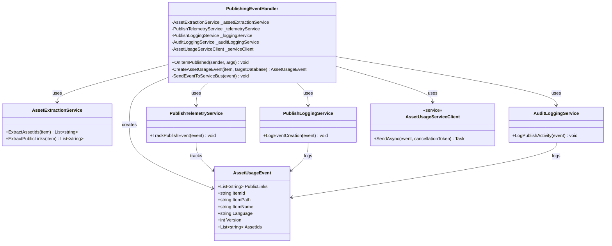

# Asset Usage Service Overview

A microservice for tracking and managing relationships between items and digital assets across Sitecore CMS and ContentHub DAM. Built as an Azure Function application with MongoDB storage.

## Architecture

Microservice diagram:


Publishing script diagram:


### System Components

```
┌──────────────────────────────────────────────────────────────────┐
│                        SITECORE CMS                               │
│                                                                    │
│  ┌──────────────────────────────────────────────────────────┐   │
│  │         iO.Sitecore.Publishing Module                     │   │
│  │         - PublishEventHandler                             │   │
│  │         - OnItemProcessing                                │   │
│  │         - OnItemProcessed                                 │   │
│  │         - OnPublishEnd                                    │   │
│  └────────────────────────┬─────────────────────────────────┘   │
│                           │                                       │
└───────────────────────────┼───────────────────────────────────────┘
                            │
                            │ HTTP POST
                            │ (Publish Events)
                            ▼
┌──────────────────────────────────────────────────────────────────┐
│                   ASSET USAGE SERVICE                             │
│                   (Azure Functions)                               │
│                                                                    │
│  ┌──────────────────────────────────────────────────────────┐   │
│  │             SitecorePublishAPI                            │   │
│  │             (HTTP Trigger)                                │   │
│  └────────────────────────┬─────────────────────────────────┘   │
│                           │                                       │
│  ┌────────────────────────▼─────────────────────────────────┐   │
│  │           Business Layer                                  │   │
│  │           - AssetItemController                           │   │
│  │           - DeltaCalculationService                       │   │
│  │           - PushToDamHandler                              │   │
│  └────────────────────────┬─────────────────────────────────┘   │
│                           │                                       │
│  ┌────────────────────────▼─────────────────────────────────┐   │
│  │           Infrastructure Layer                            │   │
│  │           - AssetItemLinkRepository                       │   │
│  └────────────────────────┬─────────────────────────────────┘   │
│                           │                                       │
│  ┌────────────────────────▼─────────────────────────────────┐   │
│  │           Data Access Layer                               │   │
│  │           - DBContext                                     │   │
│  └────────────────────────┬─────────────────────────────────┘   │
│                           │                                       │
└───────────────────────────┼───────────────────────────────────────┘
                            │
        ┌───────────────────┼────────────────────┐
        │                   │                    │
        ▼                   ▼                    ▼
  ┌──────────┐      ┌──────────────┐    ┌──────────────┐
  │ MongoDB  │      │  ContentHub  │    │ Application  │
  │ Database │      │     DAM      │    │   Insights   │
  └──────────┘      └──────────────┘    └──────────────┘
```

## Complete Data Flow

### 1. Sitecore Publish Event Flow

```
SITECORE CMS
     │
     │ (1) User publishes item
     ▼
┌─────────────────────────────────┐
│  Sitecore Publishing Pipeline   │
└──────────────┬──────────────────┘
               │
               │ (2) Trigger publish:itemProcessing event
               ▼
┌─────────────────────────────────┐
│ iO.Sitecore.Publishing          │
│ PublishEventHandler             │
│ OnItemProcessing()              │
└──────────────┬──────────────────┘
               │
               │ (3) Extract item data:
               │     - Item ID (Guid)
               │     - Asset references
               │     - Public links
               │     - Metadata
               ▼
┌─────────────────────────────────┐
│ AssetUsageServiceClient         │
│ SendAsync()                     │
└──────────────┬──────────────────┘
               │
               │ (4) HTTP POST to Asset Usage Service
               │     Endpoint: /api/SitecorePublishAPI
               │     Body: AssetUsageEvent {
               │       "itemId": "guid",
               │       "assetIds": ["123", "456"],
               │       "publicLinks": ["..."],
               │       "itemName": "...",
               │       "itemPath": "...",
               │       "language": "en",
               │       "version": 1
               │     }
               ▼
┌─────────────────────────────────┐
│ ASSET USAGE SERVICE             │
│ SitecorePublishAPI Function     │
└──────────────┬──────────────────┘
               │
               │ (5) Process publish event
               ▼
     [Continue to Service Processing Flow]
```

### 2. Asset Usage Service Processing Flow

```
Asset Usage Service
     │
     │ (1) Receive publish event from Sitecore
     ▼
┌─────────────────────────────────┐
│ SitecorePublishAPI              │
│ (HTTP Trigger)                  │
└──────────────┬──────────────────┘
               │
               │ (2) Validate request
               │     - Check payload
               ▼
┌─────────────────────────────────┐
│ MessageHandler                  │
│ HandleMessageAsync()            │
└──────────────┬──────────────────┘
               │
               │ (3) Map DTO to Domain
               ▼
┌─────────────────────────────────┐
│ PublishedItemMapper             │
│ MapToDomain()                   │
└──────────────┬──────────────────┘
               │
               │ (4) Process published item
               ▼
┌─────────────────────────────────┐
│ AssetItemController             │
│ ProcessPublishedItemAsync()     │
└──────────────┬──────────────────┘
               │
               │ (5) Get asset IDs from public links
               ▼
┌─────────────────────────────────┐
│ PublishAssetIdsByPublicLinks    │
│ EventService                    │
└──────────────┬──────────────────┘
               │
               │ (6) Calculate delta changes
               ▼
┌─────────────────────────────────┐
│ DeltaCalculationService         │
│ CalculateDeltaAsync()           │
└──────────────┬──────────────────┘
               │
               │ (7) Query existing relationships
               ▼
┌─────────────────────────────────┐
│ AssetItemLinkRepository         │
│ GetAssetItemLinkByItemIdAsync() │
└──────────────┬──────────────────┘
               │
               │ (8) Fetch from MongoDB
               ▼
┌─────────────────────────────────┐
│ MongoDB Database                │
│ AssetItemLinks Collection       │
└──────────────┬──────────────────┘
               │
               │ (9) Return existing data
               ▼
┌─────────────────────────────────┐
│ DeltaCalculationService         │
│ - Calculate added assets        │
│ - Calculate removed assets      │
└──────────────┬──────────────────┘
               │
               │ (10) Update MongoDB
               ▼
┌─────────────────────────────────┐
│ AssetItemLinkRepository         │
│ InsertAssetItemLinkAsync()      │
└──────────────┬──────────────────┘
               │
               │ (11) Publish DAM events
               ▼
┌─────────────────────────────────┐
│ PublishPushToDamEventsService   │
│ PublishPushToDamEventsAsync()   │
└──────────────┬──────────────────┘
               │
               │ (12) Handle DAM updates
               ▼
     [Continue to ContentHub Flow]
```

### 3. ContentHub DAM Integration Flow

```
Asset Usage Service
     │
     │ (1) Prepare asset updates
     ▼
┌─────────────────────────────────┐
│ PushToDamHandler                │
│ Handle(PushToDamEvent)          │
└──────────────┬──────────────────┘
               │
               │ (2) Get ContentHub client
               ▼
┌─────────────────────────────────┐
│ APIGateway                      │
│ GetContentHubClientAsync()      │
└──────────────┬──────────────────┘
               │
               │ (3) Authenticate
               ▼
┌─────────────────────────────────┐
│ ContentHubConnectionService     │
│ CreateClient()                  │
└──────────────┬──────────────────┘
               │
               │ (4) OAuth2 Client Credentials
               │     - ClientId
               │     - ClientSecret
               ▼
┌─────────────────────────────────┐
│ Stylelabs M.Sdk WebClient       │
└──────────────┬──────────────────┘
               │
               │ (5) HTTPS Connection
               ▼
┌─────────────────────────────────┐
│ Sitecore ContentHub             │
│ REST API                        │
└──────────────┬──────────────────┘
               │
               │ (6) Update asset relations:
               │     - Link to Sitecore items
               │     - Update usage metadata
               │     - Set relation properties
               ▼
┌─────────────────────────────────┐
│ ContentHub Database             │
│ Asset Relations Updated         │
└─────────────────────────────────┘
```

### 4. Reverse Query Flow (Asset → Items)

```
External System / ContentHub
     │
     │ (1) Query: "Which items use Asset X?"
     ▼
┌─────────────────────────────────┐
│ Asset Usage Service API         │
│ (Future endpoint)               │
└──────────────┬──────────────────┘
               │
               │ (2) GetItemIdsByAssetId(X)
               ▼
┌─────────────────────────────────┐
│ AssetItemLinkRepository         │
└──────────────┬──────────────────┘
               │
               │ (3) MongoDB Query:
               │     db.AssetItemLinks.find({
               │       assetIds: X
               │     })
               ▼
┌─────────────────────────────────┐
│ MongoDB Database                │
│ Index Scan on assetIds          │
└──────────────┬──────────────────┘
               │
               │ (4) Return matching documents
               ▼
┌─────────────────────────────────┐
│ Response to Caller              │
│ [                               │
│   { itemId: "guid1", ... },     │
│   { itemId: "guid2", ... }      │
│ ]                               │
└─────────────────────────────────┘
```

### 5. Complete End-to-End Flow

```
┌─────────────────┐
│ SITECORE CMS    │
│                 │
│ Content Editor  │
│ publishes item  │
│ with assets     │
└────────┬────────┘
         │
         │ Publish Pipeline
         ▼
┌─────────────────────────────────┐
│ iO.Sitecore.Publishing          │
│ Event Handler                   │
│                                 │
│ 1. OnItemProcessing             │
│    - Extract item data          │
│    - Extract asset IDs          │
│    - Extract public links       │
│                                 │
│ 2. OnItemProcessed              │
│    - Create AssetUsageEvent     │
│    - POST to Asset Service      │
│                                 │
│ 3. OnPublishEnd                 │
│    - Batch processing complete  │
└────────┬────────────────────────┘
         │
         │ HTTP POST
         │ http://localhost:7183/api/SitecorePublishAPI
         ▼
┌─────────────────────────────────┐
│ ASSET USAGE SERVICE             │
│ (Azure Function)                │
│                                 │
│ 1. Receive Event                │
│    - Validate payload           │
│    - Map to domain model        │
│                                 │
│ 2. Resolve Asset IDs            │
│    - Convert public links       │
│                                 │
│ 3. Query MongoDB                │
│    - Get current state          │
│                                 │
│ 4. Calculate Delta              │
│    - Compare old vs new         │
│    - Identify changes           │
│                                 │
│ 5. Update MongoDB               │
│    - Save new relationships     │
│    - Update timestamps          │
│                                 │
│ 6. Sync to ContentHub           │
│    - Publish DAM events         │
│    - Update asset metadata      │
└────────┬────────────────────────┘
         │
         │ OAuth2 + REST API
         ▼
┌─────────────────────────────────┐
│ SITECORE CONTENTHUB             │
│                                 │
│ 1. Authenticate Request         │
│                                 │
│ 2. Update Asset Relations       │
│    - Link to Sitecore items     │
│                                 │
│ 3. Update Metadata              │
│    - Usage count                │
│    - Last used date             │
│    - Related items list         │
└─────────────────────────────────┘
```

## Core Components

| Component | Technology | Purpose |
|-----------|------------|---------|
| **Asset Usage Service** | Azure Functions (.NET 8 isolated) | Microservice that tracks asset-item relationships |
| **Database** | MongoDB / Azure CosmosDB (MongoDB API) | Storage for asset usage data |
| **Message Queue** | Azure Service Bus | Asynchronous processing of asset operations |
| **Sitecore CMS** | Sitecore XP | Content management system with iO.Sitecore.Publishing module |
| **ContentHub DAM** | Sitecore ContentHub | Digital asset management system |

### Prerequisites

- .NET 8.0 SDK or later
- Azure Functions Core Tools v4
- MongoDB instance (local or Azure CosmosDB with MongoDB API)
- Sitecore CMS instance (with iO.Sitecore.Publishing module)
- Access to Sitecore ContentHub instance

## Architecture Diagram

```
┌─────────────────┐     ┌─────────────────────────┐     ┌─────────────────┐
│   Sitecore CMS  │────▶│  Asset Usage Service    │────▶│  Content Hub    │
│                 │     │  (Azure Functions)      │     │                 │
│  - Publishing   │     │                         │     │  - Assets       │
│  - Event Handler│     │  - SitecorePublishAPI   │     │  - Public Links │
└─────────────────┘     │  - Queue Functions      │     │  - UsageTracking│
                        │                         │     └─────────────────┘
                        └───────────┬─────────────┘
                                    │
                        ┌───────────▼─────────────┐
                        │       MongoDB           │
                        │  (CosmosDB vCore)       │
                        │                         │
                        │  - AssetItemLinks       │
                        └─────────────────────────┘
```

## Key Features

1. **Asset Tracking**: Tracks relationships between Sitecore items and ContentHub assets
2. **Event-Driven**: Responds to Sitecore publish events automatically
3. **Queue-Based Processing**: Uses Azure Service Bus for reliable async operations
4. **Usage Insights**: Provides visibility into which CMS items use which assets
5. **Delete Protection**: Custom modals warn users before deleting assets in use

## Configuration Overview

### Sitecore CMS Configuration

- **Event Handler**: `iO.Publishing.Events.config` - Captures publish events
- **Service Endpoint**: `AssetUsageService.config` - Points to the Azure Function

### Azure Function Configuration

- **MongoDB Settings**: Connection string and database name
- **ContentHub Settings**: OAuth2 credentials for API access
- **Service Bus Settings**: Queue names and connection strings

### ContentHub Configuration

- **OAuth Client**: Client credentials flow for API authentication
- **Schema Extension**: `UsageTracking` JSON property on M.Asset
- **Member Security**: Read access for all, write access for service user

## Queue Functions

The service uses Azure Service Bus queues for asynchronous processing:

| Queue | Purpose |
|-------|---------|
| `contenthub-publiclinks-requests` | Process public link creation/updates |
| `contenthub-delta-calculation-requests` | Calculate asset usage changes |
| `push-to-contenthub-requests` | Push usage data to ContentHub |

## ContentHub Components

React components for the ContentHub Asset Details page:

1. **Asset Usage Tracker**: Displays which Sitecore CMS items use the asset
2. **Custom Delete Modal**: Warns users if asset is in use before deletion
3. **Custom Archive Modal**: Warns users if asset is in use before archiving

## Deployment Options

- **Azure Portal**: Configure via Deployment Center for automatic CI/CD
- **GitHub Actions**: Manual workflow setup with OIDC authentication
- **Visual Studio**: Direct publish for initial setup or hotfixes

## Required Azure Resources

| Resource | Type | Purpose |
|----------|------|---------|
| **Function App** | Azure Functions (Linux, .NET 8 isolated) | Hosts the microservice |
| **Key Vault** | Azure Key Vault | Secure storage for secrets |
| **Cosmos DB** | Azure Cosmos DB for MongoDB (vCore) | Database storage |
| **Application Insights** | Application Insights | Monitoring and telemetry |

## Monitoring

The service integrates with Azure Application Insights for:

- Request tracing and performance monitoring
- Exception tracking and diagnostics
- Custom metrics and events
- Dependency tracking (MongoDB, ContentHub, Sitecore)
